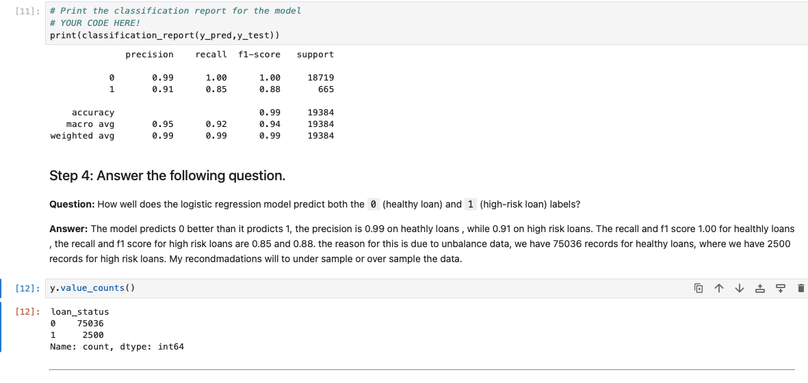

# Credit Risk Classification 
## Report
The aim of this analysis is to develop machine learning models capable of accurately predicting the creditworthiness of borrowers using historical lending activity data from a peer-to-peer lending services company.

## Description
To determine if the regression logistic model while work to approve high risk and low risk applicants.

## Table of Contents
- [Installation](#installation)
- [Usage](#usage)
- [Credits](#credits)

- [Features](#features)
- [Tests](#tests)
- [Contact](#contact)
- [Summary](#summary)

## Installation
python, numpy, pandas, confusion matrix, classification report, train split test, logistic regression 

## Financial Information in the Data

The dataset includes the following financial information:
Amount requested
Interest rate
Borrower's income
Debt-to-income ratio
Number of accounts
Any derogatory marks on the accounts
Total Debt
Variables to Predict

## The main variable to predict is the loan status, which has two values:
Healthy Loan
High-Risk Loan

## Usage
This project should be used to test the values of the data determining credit approval 

## Credits
Khristopher Prince

## Features
report on how accurate the model will predict 

## Stages of the Machine Learning Process

Data Preprocessing
Importing the necessary modules.
Reading the CSV file.
Creating the labels set (y) and features (X) DataFrame from the remaining columns.
Splitting the data into training and testing sets.
Training the Models
Creating a Logistic Regression model.
Creating a Confusion Matrix for each model.
Model Evaluation
Evaluating accuracy, precision, recall scores

## Summary
The model predicts 0 a higher percentage than 1, the precision is 0.99 on healthy loans, while 0.91 on high-risk loans. The recall and f1 score 1.00 for healthy loans, the recall and f1 score for high-risk loans are 0.85 and 0.88. the reason for this is due to unbalance data, we have 75036 records for healthy loans, where we have 2500 records for high-risk loans. My recommendations will to under sample or over sample the data. I would recommend using the model if the amount of data for each category where equal.

## Contact
If there are any questions of concerns, I can be reached at:
##### [github: Khris51](https://github.com/Khris51)
##### [email: khris51@yahoo.com](mailto:khris51@yahoo.com)
